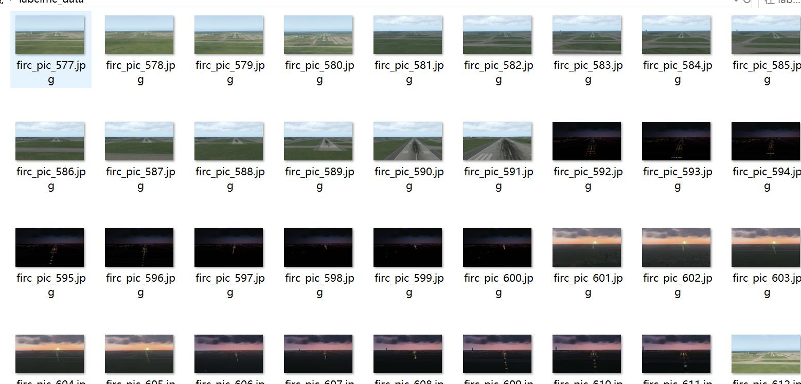
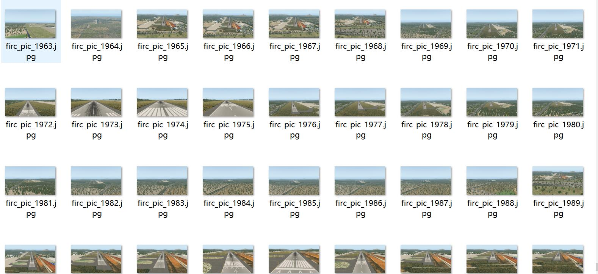
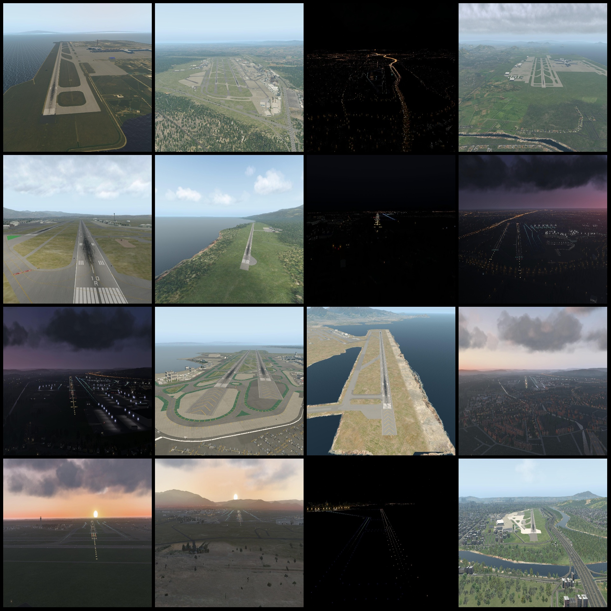
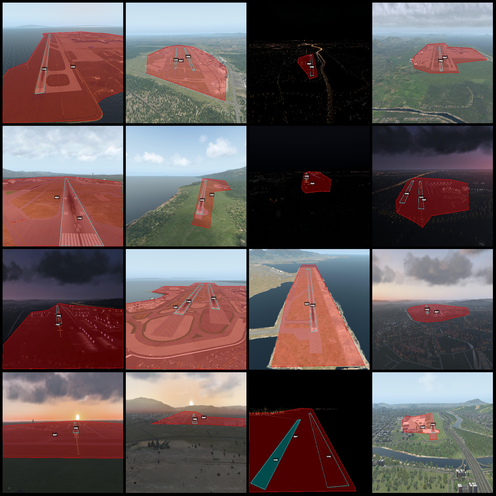
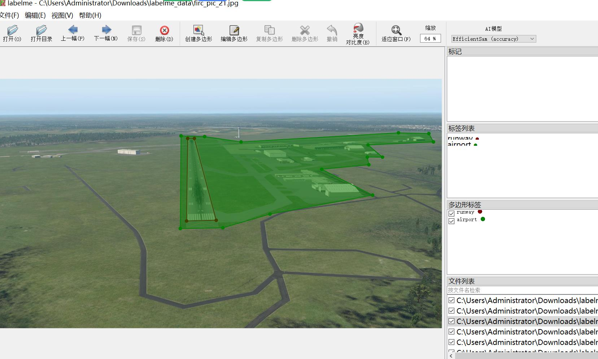

# Non-Realistic Scene Simulation Airport Runway Identification and Segmentation Dataset (labelme format) - 2000 Images in 2 Categories

Please note that the dataset is not a real scene image but a 3D model generated scene, as can be seen from the images.
The dataset format: labelme format (without mask files, only containing jpg images and corresponding json files).
Number of images (number of jpg files): 2000
Number of annotations (number of json files): 2000
Number of categories: 2
Annotation category names: ["airport", "runway"]
Number of polygons for each category:
airport count = 1987
runway count = 2267
Total number of polygons: 4254
Used labeling tool: labelme=5.5.0
Image resolution: 1920x1080
Annotation rules: Polygons are drawn around the categories.
Important Notice: You can edit the dataset using labelme. The json dataset needs to be converted into either mask or yolo format or coco format for semantic segmentation or instance segmentation.
Special Disclaimer: This dataset does not guarantee the accuracy of the trained models or weight files.
Examples of images with annotations:
Randomly selected 16 images:
Annotation drawing results:
Labelme editing example image:

## Images

Here is a pay link on Stripe ( https://buy.stripe.com/3cs8yP7sY87d0vu9AB ). Please contact me lonlonago@foxmail.com after funding $89, and I will send you a complete data files , thank you!

